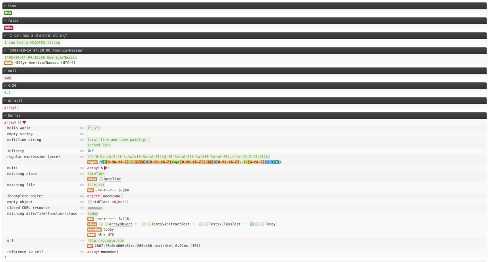

<p align="center">
<a href="https://packagist.org/packages/horizom/var-dumper"></a>
<a href="https://packagist.org/packages/horizom/var-dumper"></a>
<a href="https://packagist.org/packages/horizom/var-dumper"></a>
</p>

VarDumper, or `dump()` is a nicer alternative to PHP's [`print_r`](http://php.net/manual/en/function.print-r.php) / [`var_dump`](http://php.net/manual/en/function.var-dump.php) functions. 

This project is a fork of the original project by [digitalnature](https://github.com/digitalnature/php-ref). A big thank you to him for the work he has done on his project.

## DEMO

<br>

Or You can see full demo at [Full demo](var-dumper-full-demo.jpg)

## Installation using Composer

Add VarDumper to your `composer.json`:

```json
{
    "require": {
        "horizom/var-dumper": "^3.1"
    }
}
```

Now tell composer to download the bundle by running:

```bash
composer require horizom/var-dumper
```

Composer will install the bundle to the directory `vendor/horizom`.

## Usage

Basic example:

```php
// include the class (not needed if project runs with Composer because it's auto-loaded)
require 'vendor/autoload.php';

// display info about defined classes
dump(get_declared_classes());

// display info about global variables
dump($GLOBALS);
```

To print in text mode you can use the `dump_text()` function instead:

```php
dump_text($var);
```

To terminate the script after the info is dumped, prepend the bitwise NOT operator:

```php
~dump($var);   // html
~dump_text($var);  // text
```

Prepending the error control operator (@) will return the information:

```php
$output = @dump($var);   // html
$output = @dump_text($var);  // text
```

Keyboard shortcuts (javascript must be enabled):

- `X` - collapses / expands all levels
- `Ctrl` + `X` - toggles display state

To modify the global configuration call `\Horizom\VarDumper\VarDumper::config()`:

```php
// example: initially expand first 3 levels
\Horizom\VarDumper\VarDumper::config('expLvl', 3);
```

You can also add configuration options in your `php.ini` file like this:

```ini
[varDumper]
varDumper.expLvl = 3
varDumper.maxDepth = 4
```

Currently available options and their default values:

| Option                    | Default             | Description
|:------------------------- |:------------------- |:-----------------------------------------------
| `'expLvl'`                | `1`                 | Initially expanded levels (for HTML mode only). A negative value will expand all levels
| `'maxDepth'`              | `6`                 | Maximum depth (`0` to disable); note that disabling it or setting a high value can produce a 100+ MB page when input involves large data
| `'showIteratorContents'`  | `FALSE`             | Display iterator data (keys and values)
| `'showResourceInfo'`      | `TRUE`              | Display additional information about resources
| `'showMethods'`           | `TRUE`              | Display methods and parameter information on objects
| `'showPrivateMembers'`    | `FALSE`             | Include private properties and methods
| `'showStringMatches'`     | `TRUE`              | Perform and display string matches for dates, files, json strings, serialized data, regex patterns etc. (SLOW)
| `'formatters'`            | `array()`           | Custom/external formatters (as associative array: format => className)
| `'shortcutFunc'`          | `array('dump', 'dump_text')`  | Shortcut functions used to detect the input expression. If they are namespaced, the namespace must be present as well (methods are not  supported)
| `'stylePath'`             | `'{:dir}/assets/dumper.css'`  | Local path to a custom stylesheet (HTML only); `FALSE` means that no CSS is included.
| `'scriptPath'`            | `'{:dir}/assets/dumper.js'`   | Local path to a custom javascript (HTML only); `FALSE` means no javascript (tooltips / toggle / kbd shortcuts require JS)
| `'showUrls'`              | `FALSE`             | Gets information about URLs. Setting to false can improve performance (requires showStringMatches to be TRUE)
| `'timeout'`               | `10`                | Stop execution after this amount of seconds, forcing an incomplete listing. Applies to all calls
| `'validHtml'`             | `FALSE`             | For HTML mode only. Whether to produce W3C-valid HTML (larger code output) or unintelligible, potentially browser-incompatible but much smaller code output

## TODOs

- Inherit DocBlock comments from parent or prototype, if missing
- Refactor "bubbles" (for text-mode)
- Correctly indent multi-line strings (text-mode)
- Move separator tokens to ::before and ::after pseudo-elements (html-mode)

## Changelog

All notable changes to this project will be documented in the file [CHANGELOG](CHANGELOG.md).

## License

The Horizom framework is open-sourced software licensed under the [MIT license](LICENSE.md).
